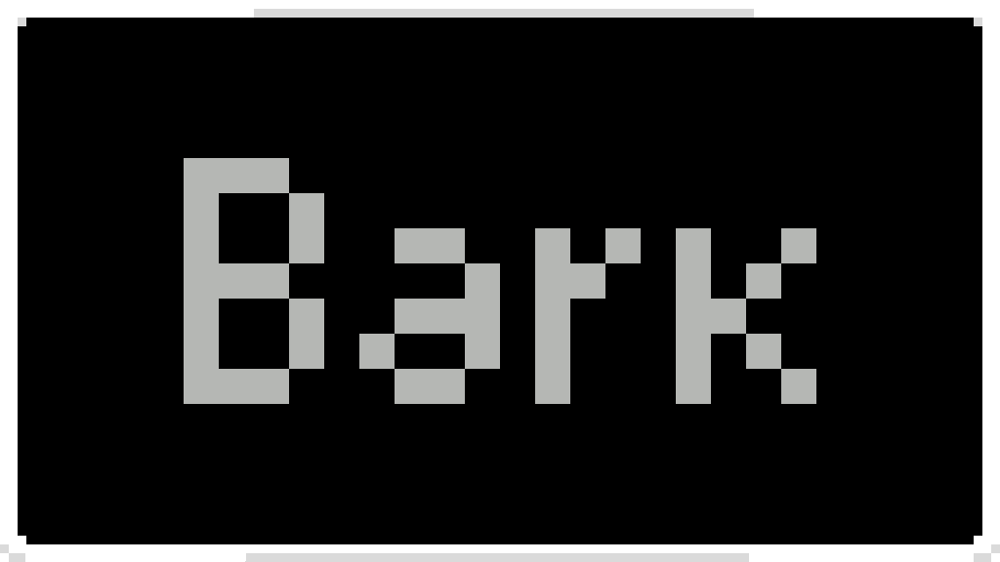

[中文指南](README_ZH.md)

# Bark

[GitHub](https://github.com/CNCUMC/Bark) | [NexusMods](https://www.nexusmods.com/scavprototype/mods/362) | [CUCoreLib](https://github.com/jimmyking9999999/CUCoreLib)

_A mod utility library for [Casualties Unknown](https://store.steampowered.com/app/4576490/), built on top
of [CUCoreLib](https://github.com/jimmyking9999999/CUCoreLib)._

_Evolved from [Moss Lib](https://github.com/Explosive-Hydra/Moss-Lib)._

---

## Table of Contents

- [Overview](#overview)
- [Installation](#installation)
- [Quick Start](#quick-start)
- [Localization](#localization)
- [Setting Options (BetterOptions)](#setting-options-betteroptions)
- [Update Checking (UpdateUtil)](#update-checking-updateutil)
- [Tools Reference](#tools-reference)
- [Constants Reference](#constants-reference)
- [License](#license)

---

## Overview

**Bark** is a BepInEx plugin utility library for **Casualties Unknown**,
extending [CUCoreLib](https://github.com/jimmyking9999999/CUCoreLib) (CCL) with enhanced localization, settings, and
game utility tools.

| Module                                        | Description                                                              |
|-----------------------------------------------|--------------------------------------------------------------------------|
| [`BetterLocale`](BetterCCL/BetterLocale.cs)   | Localization system built on CCL's `LocaleRegistry`                      |
| [`BetterOptions`](BetterCCL/BetterOptions.cs) | CCL settings registration wrapper (Float/Int/Bool/Dropdown/Keybind)      |
| [`ModLangGenBase`](Base/ModLangGenBase.cs)    | Language generator base class                                            |
| [`UpdateUtil`](Tool/UpdateUtil.cs)            | GitHub-based mod update checker                                          |
| [`PlayerUtil`](Tool/PlayerUtil.cs)            | Player: status/vitals/movement/drugs/inventory/recovery/alert/thresholds |
| [`SkillUtil`](Tool/SkillUtil.cs)              | Skill level/XP manipulation                                              |
| [`LimbUtil`](Tool/LimbUtil.cs)                | Limb operations: healing, damage, status checks                          |
| [`WorldUtil`](Tool/WorldUtil.cs)              | World manipulation: blocks, items                                        |
| [`InventoryUtil`](Tool/InventoryUtil.cs)      | Inventory operations                                                     |
| [`ItemUtil`](Tool/ItemUtil.cs)                | Item utilities: FindNearby, Repair, SetCondition                         |
| [`InputUtil`](Tool/InputUtil.cs)              | Input handling: mouse position, click waiting                            |
| [`LogUtil`](Tool/LogUtil.cs)                  | Console logging + validation helpers                                     |
| [`TextUtil`](Tool/TextUtil.cs)                | Rich text formatting: color, alpha, bold, italic, size                   |
| [`ToolsUtil`](Tool/ToolsUtil.cs)              | Argument validation, float/int parsing                                   |
| [`Blocks`](Constant/Blocks.cs)                | Strongly-typed block definitions                                         |
| [`Items`](Constant/Items.cs)                  | Strongly-typed item definitions                                          |
| [`Backgrounds`](Constant/Backgrounds.cs)      | Background ID string constants                                           |
| [`Keys`](Constant/Keys.cs)                    | Key action constants                                                     |
| [`Slots`](Constant/Slots.cs)                  | Inventory slot definitions                                               |

---

## Installation

1. Install [BepInEx 5.x](https://github.com/BepInEx/BepInEx) for Casualties Unknown.
2. Install [CUCoreLib](https://github.com/jimmyking9999999/CUCoreLib) ≥ 1.0.2 — place `CUCoreLib.dll` into
   `BepInEx/plugins/CUCoreLib/`.
3. Download the latest `Bark.dll` from the [Releases](https://github.com/CNCUMC/Bark/releases) page.
4. Place `Bark.dll` into your `BepInEx/plugins/` folder.

> **For mod developers:** Reference `Bark.dll` in your project, and add `[BepInDependency("org.cucnmc.bark")]` to your
> plugin class.

---

## Quick Start

### 1. Add Dependencies

```csharp
[BepInPlugin(Guid, Name, Version)]
[BepInDependency("net.cucorelib")]     // CCL is required
[BepInDependency("org.cucnmc.bark")]   // Bark extends CCL
public class MyPlugin : BaseUnityPlugin
{
    // ...
}
```

### 2. Localization

Bark provides `BetterLocale` on top of CCL's `LocaleRegistry`:

```csharp
using Bark.BetterCCL;

// Get localized text (CCL → Bark defaults → key fallback)
string text = BetterLocale.GetOther("bark.feature.enabled");

// Define fallback translations via language generators:
// EnLangGenerator.cs
Other("bark.feature.enabled", "Enable Feature");

// ZhCnLangGenerator.cs
Other("bark.feature.enabled", "启用功能");
```

See [Example/Lang/](Example/Lang) for sample generators.

### 3. Register a Setting

```csharp
using Bark.BetterCCL;

BetterOptions.Bool("bark", "feature_enabled", Setting.SettingCategory.Game, true);

// With custom category tab
BetterOptions.Bool("bark", "advanced_mode", "Bark", false);
```

### 4. Check for Updates

```csharp
using Bark.Tool;

// Call in Awake() — async, results output to logger + game console
UpdateUtil.Check("YourName/YourRepo", "YourMod", "1.0.0", Logger);
```

---

## Localization

### Generators (`ModLangGenBase`)

```csharp
public class EnLangGenerator : ModLangGenBase
{
    protected override string LanguageCode => "EN";
    protected override void BuildLocaleData()
    {
        Other("bark.tooltip.heat", "Hot enough to warp.");
        Option("bark.game.test", "Test Mode", "Turns on the test mode");
    }
}
```

| Method                              | Category                   |
|-------------------------------------|----------------------------|
| `Item(key, value, description)`     | `item`                     |
| `Building(key, value, description)` | `build`                    |
| `Moodle(key, value, description)`   | `moodle`                   |
| `Other(key, value)`                 | `other`                    |
| `Option(key, label, description)`   | `option` (settings labels) |
| `Log(key, value)`                   | `log`                      |
| `Command(key, value, description)`  | `command`                  |
| `Liquid(key, value, description)`   | `liquid`                   |
| `Title(key, value, description)`    | `title`                    |

### BetterLocale API

#### Get (retrieve localized text)

| Method                    | Category  |
|---------------------------|-----------|
| `GetItem(key, args?)`     | `item`    |
| `GetBuilding(key, args?)` | `build`   |
| `GetMoodle(key, args?)`   | `moodle`  |
| `GetOther(key, args?)`    | `other`   |
| `GetLog(key, args?)`      | `log`     |
| `GetCommand(key, args?)`  | `command` |
| `GetOption(key, args?)`   | `option`  |
| `GetLiquid(key, args?)`   | `liquid`  |
| `GetTitle(key, args?)`    | `title`   |

> **Note:** `args` replace `{0}`, `{1}`, etc. in the resolved locale value.
> For example, `BetterLocale.GetLog("update.available", "Bark", "1.0", "2.0")` returns
> `"Bark update available! 1.0 -> 2.0"`.

#### Has (check if translation exists)

| Method                  | Category     |
|-------------------------|--------------|
| `HasKey(category, key)` | Any category |
| `HasKeyItem(key)`       | `item`       |
| `HasKeyBuilding(key)`   | `build`      |
| `HasKeyMoodle(key)`     | `moodle`     |
| `HasKeyOther(key)`      | `other`      |
| `HasKeyLog(key)`        | `log`        |
| `HasKeyCommand(key)`    | `command`    |
| `HasKeyOption(key)`     | `option`     |
| `HasKeyLiquid(key)`     | `liquid`     |
| `HasKeyTitle(key)`      | `title`      |

#### Other

| Method                            | Description                                |
|-----------------------------------|--------------------------------------------|
| `SetDefault(lang, cat, key, val)` | Register fallback value                    |
| `Flush()`                         | Write all defaults to CCL locale directory |
| `ToRichText(md)`                  | Convert **Markdown** to Unity Rich Text    |
| `StripMarkdown(md)`               | Strip markdown to plain text               |

---

## Setting Options (BetterOptions)

```csharp
BetterOptions.Bool("ns", "key", Setting.SettingCategory.Game, true);
BetterOptions.Int("ns", "level", Setting.SettingCategory.Game, 5, 1, 10);
BetterOptions.Float("ns", "volume", Setting.SettingCategory.Audio, 0.8f, 0f, 1f);
BetterOptions.Dropdown("ns", "mode", Setting.SettingCategory.Game, 0, choices);
BetterOptions.Keybind("ns", "hotkey", Setting.SettingCategory.Input, KeyCode.F5);

// Custom category tab
BetterOptions.Bool("ns", "key", "My Mod Tab", false);
```

---

## Update Checking (UpdateUtil)

```csharp
using Bark.Tool;

// Async check via GitHub Releases API — localizable messages
UpdateUtil.Check("CNCUMC/Bark", "MyMod", "1.0.0", Logger);
```

| Parameter        | Description                                       |
|------------------|---------------------------------------------------|
| `githubRepo`     | GitHub repo path, e.g. `"CNCUMC/Bark"`            |
| `modName`        | Display name used in log/console messages         |
| `currentVersion` | Current version, supports `"1.0.0"` or `"v1.0.0"` |
| `logger`         | Mod's BepInEx `ManualLogSource`                   |

Results are output to both the BepInEx log and the game console. Messages are localized via `BetterLocale`
(`update.no_repo`, `update.failed`, `update.no_version`, `update.available`, `update.uptodate`).

---

## Tools Reference

### LogUtil

| Method                                       | Description                     |
|----------------------------------------------|---------------------------------|
| `Info(text, logger)`                         | Log to console + BepInEx        |
| `Error(text, logger)`                        | Log error                       |
| `Warning(text, logger)`                      | Log warning                     |
| `CheckWorld(logger?)`                        | Throw if no world loaded        |
| `CheckBody(logger?)`                         | Throw if player body is null    |
| `CheckArgumentCount(args, min, logger?)`     | Validate argument count         |
| `CheckNotNullOrEmpty(val, name, logger?)`    | Validate string not empty       |
| `CheckParseFloat(s, logger?)`                | Parse float or throw            |
| `CheckParseInt(s, logger?)`                  | Parse int or throw              |
| `PrintList(header, items, logger)`           | Print formatted list to console |
| `PrintNumberedList(header, items, logger)`   | Print numbered list             |
| `PrintKeyValueList(header, entries, logger)` | Print key-value pairs           |
| `PrintGroupedList(header, groups, logger)`   | Print grouped items             |

### PlayerUtil

| Group                                               | Description                |
|-----------------------------------------------------|----------------------------|
| `Status.IsAlive()` / `Status.IsConscious()`         | State checks               |
| `Vitals.GetBloodOxygen()` / `Vitals.GetHeartRate()` | Vital signs read/write     |
| `Vitals.SetHunger(val)` / `Vitals.SetThirst(val)`   | Raw writes                 |
| `Movement.Teleport(x, y)`                           | Teleport player            |
| `Drugs.HasPainkillers()` / `Drugs.GetCaffeinated()` | Drugs & psychological      |
| `Inventory.PickUpItem(id, slot, force?)`            | Add item to inventory slot |
| `Recovery.HealAll()` / `Recovery.Feed(amount)`      | Recovery & healing         |
| `Alert.Show(text, important, delay?)`               | UI alert                   |
| `Body` (property)                                   | Game Body reference        |
| `Thresholds.*`                                      | Constant threshold values  |

### WorldUtil

| Method                           | Description           |
|----------------------------------|-----------------------|
| `PlaceBlock(x, y, id)`           | Place a block         |
| `FillBlocks(sx, sy, ex, ey, id)` | Fill area with blocks |
| `PlaceItem(x, y, id)`            | Spawn an item         |

### SkillUtil

| Method                      | Description           |
|-----------------------------|-----------------------|
| `GetLevel(skill)`           | Get skill level       |
| `GetExperience(skill)`      | Get XP amount         |
| `SetLevelRaw(skill, level)` | Set level directly    |
| `AddExperience(skill, xp)`  | Add experience        |
| `XpMultiplier`              | Get/set XP multiplier |

### LimbUtil

| Method                               | Description               |
|--------------------------------------|---------------------------|
| `GetLimb(index/slot/name)`           | Get limb by index or name |
| `HasBrokenBone()` / `HasInfection()` | Status checks             |
| `HealLimb(limb)`                     | Full limb heal            |
| `SetSkinHealthRaw(limb, value)`      | Raw writes                |

### InventoryUtil

| Method                   | Description           |
|--------------------------|-----------------------|
| `HasItem(id)`            | Check if holding item |
| `GetItem(slot)`          | Get item by slot      |
| `GetAllItems()`          | Get all items         |
| `GetAllItemInfos()`      | Get all ItemInfo      |
| `FindById(id, out item)` | Find item by ID       |

### ItemUtil

| Method                           | Description                 |
|----------------------------------|-----------------------------|
| `FindNearby(center, radius)`     | Find items in circular area |
| `FindClosest(center, maxRadius)` | Find nearest item           |
| `Repair(item)`                   | Repair to full condition    |
| `SetCondition(item, val)`        | Set durability (0~1)        |

### InputUtil

| Method                | Description               |
|-----------------------|---------------------------|
| `WaitForLeftClick()`  | Coroutine: wait for click |
| `WaitForRightClick()` | Coroutine: wait for click |

---

## Constants Reference

### Blocks

```csharp
ushort blockId = Blocks.SteelTile;  // implicit conversion
Blocks block = Blocks.FromId(6);
```

### Items

```csharp
string itemId = Items.Medkit;       // implicit conversion
Items item = Items.FromId("medkit");
```

### Backgrounds / Keys / Slots

```csharp
string bgId = Backgrounds.Rock;
KeyCode key = Keys.Jump;
int slotId = Slots.MainHand;
```

---

## License

[LGPL v3](LICENSE.md)
